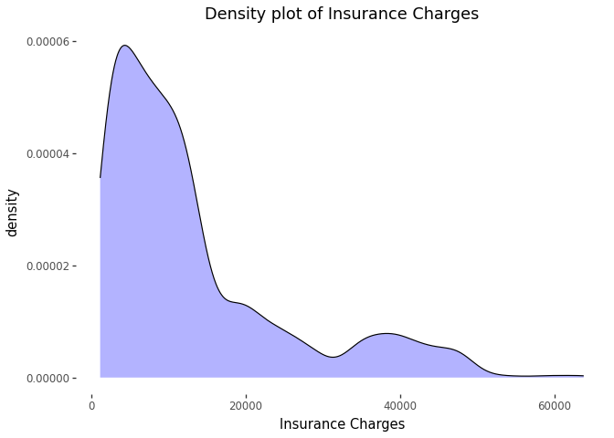
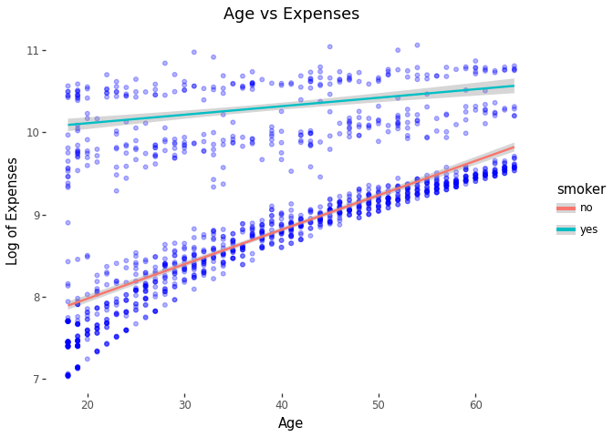
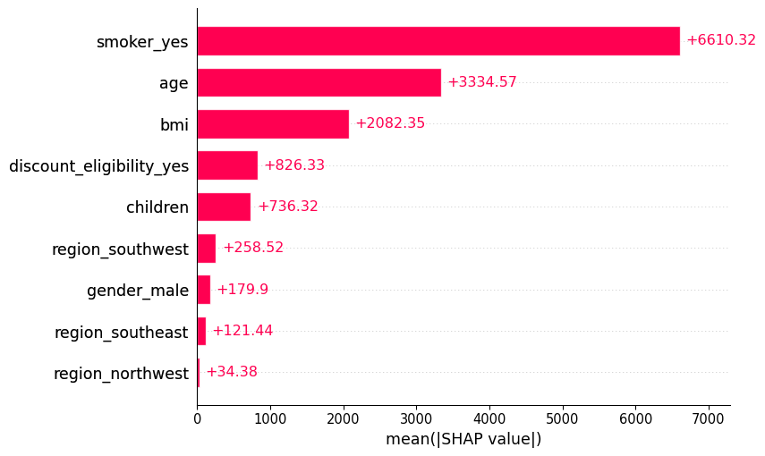

# Predicting Healthcare Insurance Expenses with Machine Learning


## Overview

This project focuses on **predicting healthcare insurance expenses**
using demographic and lifestyle-related patient data. As healthcare
costs in the United States are expected to rise sharply with the
expiration of Affordable Care Act (ACA) subsidies in 2025, accurately
estimating medical expenses has become increasingly important for
individuals planning their finances.

To address this problem, we compare two regression approaches:

- **Linear Regression**
- **XGBoost Regression**

The objective is not only to predict insurance charges accurately, but
also to understand **which factors most strongly influence healthcare
costs**.

------------------------------------------------------------------------

## Why This Project Matters

Roughly **24 million Americans** are enrolled in ACA health plans and
may experience substantial premium increases if subsidies expire. Some
projections estimate that average annual premiums could more than
double, creating major uncertainty for households that depend on
predictable healthcare expenses.

This project is important because:

- Healthcare costs significantly impact household budgeting
- Predictive models can improve **cost transparency**
- The model relies on **non-sensitive, commonly available data**
- Results could support tools such as **consumer-facing cost estimation
  dashboards**

Rather than relying on detailed medical histories, this project
demonstrates that healthcare expenses can be predicted effectively using
**lifestyle and demographic features alone**.

------------------------------------------------------------------------

## Dataset Description

- **Total observations:** 1,338  
- **Total features used:** 8  
- **Target variable:** Insurance expenses (USD)

### Input Features

| Feature             | Type        | Description                |
|---------------------|-------------|----------------------------|
| `age`               | Integer     | Patient age                |
| `sex`               | Categorical | Male or Female             |
| `bmi`               | Float       | Body Mass Index            |
| `children`          | Integer     | Number of dependents       |
| `smoker`            | Categorical | Smoking status             |
| `discount_eligible` | Categorical | Discount eligibility       |
| `region`            | Categorical | Geographic region          |
| `expenses`          | Float       | Insurance charges (target) |

### Dropped Feature

- **`premium`**  
  This column was removed due to extremely high correlation with the
  target variable. In some cases, the premium was simply a scaled
  version of expenses, which could introduce leakage and distort model
  training.

``` python
df.drop('premium', axis = 1, inplace=True)
```

### Preprocessing Summary

- No missing values in the dataset
- Categorical features were one-hot encoded
- XGBoost model used an 80/20 train-test split with a fixed random seed

------------------------------------------------------------------------

## Exploratory Data Analysis

Several visualizations were used to better understand the data:

- **Distribution of insurance expenses**  
  Charges are heavily right-skewed, with most values below \$20,000 and
  a smaller number of high-cost outliers.


- **Expenses by gender (log scale)**  
  Female charges cluster more tightly around the mean, while males
  account for more extreme values.



- **Age vs. expenses split by smoking status**  
  Expenses increase with age, and smokers consistently exhibit
  significantly higher costs across age groups.



These trends motivated the use of a nonlinear model in addition to
linear regression.

------------------------------------------------------------------------

## Modeling Approach

### Linear Regression

Linear regression was selected for its simplicity and interpretability.
Interaction terms were introduced to better capture relationships
between variables such as age and BMI, while some categorical variables
were kept as standalone predictors.

**Strengths** - Easy to interpret - Fast training time - Useful for
understanding feature relationships

**Limitations** - Assumes linear relationships - Sensitive to outliers -
Struggles with nonlinear patterns

**Performance Summary** - R²: 0.854  
- MAE: 2,801.95  
- MSE: 21,457,697.71

The model performed well on low-to-medium expense values but struggled
to capture higher-cost cases.

------------------------------------------------------------------------

### XGBoost Regression

XGBoost was chosen to model more complex, nonlinear relationships in the
data. Extensive hyperparameter tuning was performed to balance model
complexity and generalization.

``` python
watchlist = [(X_train, y_train)]
model = xgb.XGBRegressor(
        objective='reg:squarederror',
        eta = .005,
        n_estimators=1500,
        max_depth = 3,
        min_child_weight = 3,
        reg_lambda = 6,
        reg_alpha = 2,
        subsample = 0.9,
        colsample_bytree = 0.9,
        tree_method = 'hist'
    )

model.fit(X_train, y_train, eval_set = watchlist, verbose = False)
y_pred = model.predict(X_test)
```

**Strengths** - High predictive accuracy - Captures nonlinear
interactions - Built-in regularization - Supports feature importance and
SHAP analysis

**Limitations** - Less interpretable than linear models - Requires
careful tuning - Computationally more expensive

**Performance Summary** - R²: 0.9099  
- MAE: 2,143.17  
- MSE: 1,376,681.79

XGBoost significantly outperformed linear regression across all metrics.

------------------------------------------------------------------------

## Feature Importance & Interpretability

To understand model behavior, feature importance metrics and **SHAP
(SHapley Additive exPlanations)** values were analyzed.



### Key Feature Importance Insights

- **Smoking status** is the most influential predictor of insurance
  expenses
  - Associated with an increase of approximately \$6,676 in charges
- **Age** and **BMI** are the next most impactful features
- Lifestyle factors dominate over:
  - Gender
  - Region
  - Discount eligibility

SHAP directionality analysis shows that smoking almost always increases
costs, while age and BMI can both increase or decrease expenses
depending on context.

------------------------------------------------------------------------

## Key Findings

- XGBoost substantially outperforms linear regression
- Insurance charges are driven primarily by **lifestyle-related
  factors**
- Nonlinear relationships are present and meaningful
- Strong predictive performance can be achieved without sensitive
  medical data

------------------------------------------------------------------------

## Discussion

Despite extensive optimization of interaction terms, the linear
regression model could not match the performance of XGBoost. This
suggests that healthcare expenses are influenced by complex, nonlinear
relationships that tree-based models are better equipped to capture.

The results also reinforce the idea that **individual lifestyle
choices**, particularly smoking, play a larger role in determining
healthcare costs than demographic characteristics such as gender or
geographic region.

------------------------------------------------------------------------

## Conclusion & Future Work

This project demonstrates that healthcare insurance expenses can be
predicted with high accuracy using machine learning models and a limited
set of non-sensitive features. As healthcare costs continue to rise,
predictive tools like this can help individuals better anticipate and
budget for medical expenses.

Future improvements could include:

- Additional tuning to reduce underestimation in XGBoost predictions
- Exploration of more advanced models
- Incorporation of new features such as:
  - Insurance carrier
  - Pre-existing conditions
- Development of an interactive dashboard allowing users to estimate
  potential healthcare costs

------------------------------------------------------------------------

## Authors

- **Connor McHugh**
- **Luis Martinez**
